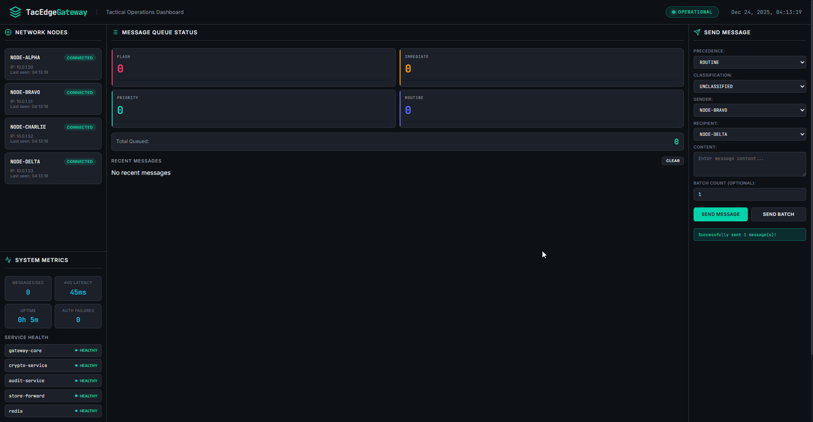
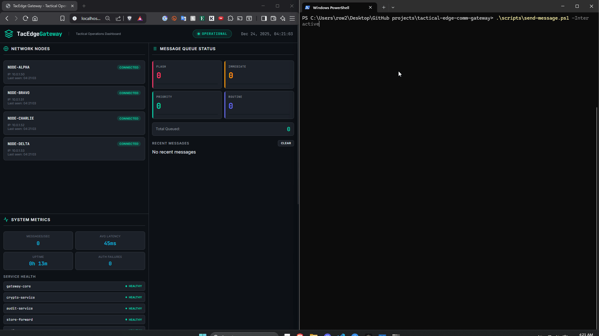

# Tactical Edge Communications Gateway (TacEdge-Gateway)

[](https://github.com/ryanwelchtech/tactical-edge-comm-gateway/actions/workflows/ci.yml)
[](https://github.com/ryanwelchtech/tactical-edge-comm-gateway/actions/workflows/security-scan.yml)
[](https://opensource.org/licenses/MIT)

A **Zero Trust**, containerized tactical communications gateway platform designed for secure message routing in defense and mission-critical environments. This system implements military-standard message precedence levels, end-to-end encryption, store-and-forward capabilities for disconnected operations, and comprehensive audit logging aligned with **NIST 800-53** control families.

**[📊 View Full Architecture Diagrams](docs/images/architecture-diagram.md)** - Interactive Mermaid diagrams showing system design, message flow, and NIST compliance mapping.

**[🎥 Dashboard Demo](docs/images/dashboard-demo.gif)** - Watch the tactical operations dashboard in action

**[📖 Dashboard User Guide](docs/UI_GUIDE.md)** - Complete guide to using the tactical operations dashboard interface

---

## 🎯 Mission Statement

TacEdge-Gateway simulates a tactical communications relay system designed for:
- **Contested/Degraded Environments**: Store-and-forward capability for intermittent connectivity
- **Multi-Domain Operations**: Secure message routing between tactical nodes
- **Zero Trust Security**: JWT-based authentication with service-level authorization
- **Compliance-Ready**: NIST 800-53 aligned audit logging and access controls

---

## 🏗️ System Architecture

```
┌─────────────────────────────────────────────────────────────────────────────┐
│                        TACTICAL EDGE COMM GATEWAY                           │
├─────────────────────────────────────────────────────────────────────────────┤
│                                                                             │
│  ┌──────────────┐    ┌──────────────┐    ┌──────────────┐                  │
│  │   TACTICAL   │    │   TACTICAL   │    │   TACTICAL   │                  │
│  │   NODE A     │◄──►│   GATEWAY    │◄──►│   NODE B     │                  │
│  │  (Sender)    │    │    CORE      │    │  (Receiver)  │                  │
│  └──────────────┘    └──────┬───────┘    └──────────────┘                  │
│                             │                                               │
│         ┌───────────────────┼───────────────────┐                          │
│         │                   │                   │                          │
│         ▼                   ▼                   ▼                          │
│  ┌──────────────┐    ┌──────────────┐    ┌──────────────┐                  │
│  │   CRYPTO     │    │   STORE &    │    │   AUDIT      │                  │
│  │   SERVICE    │    │   FORWARD    │    │   SERVICE    │                  │
│  │  (AES-256)   │    │   (Redis)    │    │ (NIST 800-53)│                  │
│  └──────────────┘    └──────────────┘    └──────────────┘                  │
│                                                                             │
│  ┌─────────────────────────────────────────────────────────────────────┐   │
│  │                    TACTICAL OPERATIONS DASHBOARD                     │   │
│  │         Real-time message status, network health, audit logs         │   │
│  └─────────────────────────────────────────────────────────────────────┘   │
│                                                                             │
└─────────────────────────────────────────────────────────────────────────────┘
```

---

## 🚀 Key Features

### Message Precedence Handling
Military-standard message priority levels with guaranteed delivery ordering:

| Precedence | Priority | Max Latency | Use Case |
|------------|----------|-------------|----------|
| **FLASH** | P1 | < 100ms | Immediate threat/engagement |
| **IMMEDIATE** | P2 | < 500ms | Time-critical operations |
| **PRIORITY** | P3 | < 2s | Urgent operational traffic |
| **ROUTINE** | P4 | Best effort | Administrative/logistics |

### Zero Trust Architecture
- **JWT-based Service Authentication**: All inter-service calls authenticated
- **Role-Based Access Control (RBAC)**: Operator, Supervisor, Admin roles
- **Service Mesh Ready**: mTLS between all microservices
- **No Implicit Trust**: Every request validated at service boundary

### Store-and-Forward (DNVT Mode)
- **Disconnected Operations**: Messages queued during network outages
- **Priority-Based Forwarding**: FLASH messages transmitted first on reconnection
- **Delivery Confirmation**: End-to-end acknowledgment tracking
- **TTL Management**: Configurable message expiration

### NIST 800-53 Compliance
Audit logging mapped to specific control families:

| Control Family | Implementation |
|----------------|----------------|
| **AC (Access Control)** | JWT validation, RBAC enforcement |
| **AU (Audit & Accountability)** | Structured event logging, tamper-evident logs |
| **IA (Identification & Authentication)** | Service identity verification |
| **SC (System & Communications Protection)** | AES-256-GCM encryption |
| **SI (System & Information Integrity)** | Message integrity validation |

---

## 📁 Project Structure

```
tactical-edge-comm-gateway/
├── README.md                          # Project documentation
├── LICENSE                            # MIT License
├── docker-compose.yml                 # Local development deployment
├── .github/
│   └── workflows/
│       ├── ci.yml                     # CI/CD pipeline
│       └── security-scan.yml          # Container security scanning
├── services/
│   ├── gateway-core/                  # Message routing & precedence
│   │   ├── Dockerfile
│   │   ├── requirements.txt
│   │   └── src/
│   │       ├── main.py
│   │       ├── auth.py
│   │       ├── message_handler.py
│   │       └── routes.py
│   ├── crypto-service/                # Encryption/decryption service
│   │   ├── Dockerfile
│   │   ├── requirements.txt
│   │   └── src/
│   │       ├── main.py
│   │       └── crypto_engine.py
│   ├── audit-service/                 # NIST 800-53 compliant logging
│   │   ├── Dockerfile
│   │   ├── requirements.txt
│   │   └── src/
│   │       ├── main.py
│   │       └── audit_logger.py
│   └── store-forward/                 # Disconnected ops message queue
│       ├── Dockerfile
│       ├── requirements.txt
│       └── src/
│           ├── main.py
│           └── queue_manager.py
├── dashboard/                         # Tactical operations dashboard
│   ├── Dockerfile
│   ├── package.json
│   └── src/
│       ├── index.html
│       ├── app.js
│       └── styles.css
├── deploy/
│   └── k8s/
│       └── base/                      # Kubernetes manifests
│           ├── namespace.yaml
│           ├── gateway-deployment.yaml
│           ├── crypto-deployment.yaml
│           ├── audit-deployment.yaml
│           ├── store-forward-deployment.yaml
│           ├── dashboard-deployment.yaml
│           ├── services.yaml
│           └── network-policies.yaml
├── scripts/
│   └── generate-jwt.py                # JWT token generator for API testing
├── tests/                              # Unit and integration tests
│   ├── test_gateway.py                # Gateway service tests
│   ├── test_crypto.py                 # Crypto service tests
│   └── test_integration.py             # End-to-end integration tests
└── docs/
    ├── ARCHITECTURE.md                 # Detailed system architecture
    ├── SECURITY.md                     # Security design & controls
    ├── OPERATIONS.md                   # Operational runbook
    ├── API.md                          # API documentation
    └── UI_GUIDE.md                     # Dashboard user guide
```

---

## 🛠️ Quick Start

### Prerequisites
- Docker & Docker Compose
- Python 3.11+ (for local development)
- Node.js 20+ (for dashboard development)
- kubectl (for Kubernetes deployment)

### Option 1: Docker Compose (Recommended)

```bash
# Clone the repository
git clone https://github.com/ryanwelchtech/tactical-edge-comm-gateway.git
cd tactical-edge-comm-gateway

# Start all services
docker-compose up -d

# View logs
docker-compose logs -f

# Access the dashboard
# Open http://localhost:8081 in your browser
```

### Option 2: Local Development

```bash
# Clone the repository
git clone https://github.com/ryanwelchtech/tactical-edge-comm-gateway.git
cd tactical-edge-comm-gateway

# Start Redis (required for store-forward)
docker run -d -p 6379:6379 --name redis redis:alpine

# Install dependencies for each service
cd services/gateway-core && pip install -r requirements.txt && cd ../..
cd services/crypto-service && pip install -r requirements.txt && cd ../..
cd services/audit-service && pip install -r requirements.txt && cd ../..
cd services/store-forward && pip install -r requirements.txt && cd ../..

# Start services (each in separate terminal)
cd services/gateway-core/src && python main.py
cd services/crypto-service/src && python main.py
cd services/audit-service/src && python main.py
cd services/store-forward/src && python main.py

# Start dashboard
cd dashboard && npm install && npm start
```

### Option 3: Kubernetes Deployment

```bash
# Apply manifests
kubectl apply -f deploy/k8s/base/

# Wait for pods
kubectl wait --for=condition=ready pod -l app=tacedge -n tacedge-system --timeout=120s

# Port forward dashboard
kubectl port-forward svc/dashboard -n tacedge-system 8080:80
```

---

## 🎮 Demo Walkthrough

### Quick Start Demo



**Watch the full demo:** The dashboard demonstrates real-time message routing, priority-based queuing, and comprehensive audit logging in action.



**API Demo:** See how to send messages via the REST API with JWT authentication.

### 1. Start the System

```bash
# Start all services with Docker Compose
docker-compose up -d

# Access the dashboard at http://localhost:8081
```

### 2. Using the Dashboard

**[📖 Complete UI Guide](docs/UI_GUIDE.md)** - Comprehensive guide to using the tactical operations dashboard.

#### Quick Start

1. **Access the Dashboard:** Open `http://localhost:8081` in your browser
2. **Dashboard starts clean:** No messages displayed on initial load
3. **Send a message:**
   - Fill in the form on the right panel
   - Select precedence, classification, sender, recipient
   - Enter message content
   - Click "Send Message"
4. **View messages:** Messages appear in "Recent Messages" within 2 seconds
5. **View details:** Click any message to see full content and metadata
6. **Clear messages:** Click "Clear" button to remove all messages from the list

#### Key Features

- **Real-time Message Queue Monitoring**: Visualize FLASH, IMMEDIATE, PRIORITY, and ROUTINE message queues with live updates
- **Network Node Health**: Monitor 4+ tactical nodes with connection status and last-seen timestamps
- **System Metrics**: Track messages/sec, average latency, uptime, and authentication failures
- **Service Health Monitoring**: Real-time status of all microservices (gateway-core, crypto-service, audit-service, store-forward, redis)
- **Recent Messages Timeline**: View delivered messages with precedence tags, sender/recipient, and timestamps
- **Clickable Messages**: Click any message to view full content, metadata, and audit trail
- **Clear Messages**: Remove all messages from the list (stays cleared until new messages are sent)
- **Web-based Message Sender**: Send single or batch messages directly from the dashboard
- **Audit Event Logging**: NIST 800-53 compliant audit trail with event types and timestamps

### 3. API Demo

```bash
# Generate a JWT token for the Operator role
python scripts/generate-jwt.py --role operator --node NODE-ALPHA

# Send a FLASH Priority Message
curl -X POST http://localhost:5000/api/v1/messages \
  -H "Authorization: Bearer <your-token>" \
  -H "Content-Type: application/json" \
  -d '{
    "precedence": "FLASH",
    "classification": "UNCLASSIFIED",
    "sender": "NODE-ALPHA",
    "recipient": "NODE-BRAVO",
    "content": "URGENT: Threat detected at grid reference 12345678",
    "ttl": 300
  }'

# View messages in the dashboard - they appear in real-time!
```

### 4. Priority-Based Queuing Demo

The system implements **military-standard priority-based message queuing** where messages are processed in strict precedence order: **FLASH → IMMEDIATE → PRIORITY → ROUTINE**.

#### How Priority-Based Queuing Works

1. **Separate Queues by Precedence**: Each message precedence level has its own dedicated queue in Redis
   - `FLASH` queue (Priority 1) - Highest priority
   - `IMMEDIATE` queue (Priority 2)
   - `PRIORITY` queue (Priority 3)
   - `ROUTINE` queue (Priority 4) - Lowest priority

2. **Automatic Priority Processing**: A background worker processes queues every 2 seconds in strict priority order:
   - First, all FLASH messages are processed
   - Then, all IMMEDIATE messages
   - Then, all PRIORITY messages
   - Finally, all ROUTINE messages

3. **Queue Depth Visualization**: The dashboard displays real-time queue depths for each precedence level in the "Message Queue Status" panel

#### Step-by-Step: Demonstrating Priority-Based Queuing

**Step 1: Send Messages with Different Precedence Levels**

Using the dashboard's "Send Message" panel, send messages in this order:

1. Send a **ROUTINE** message: "Routine status update"
2. Send a **PRIORITY** message: "Priority operational request"
3. Send an **IMMEDIATE** message: "Immediate action required"
4. Send a **FLASH** message: "FLASH: Critical alert!"

**Step 2: Observe Queue Depths**

Watch the "Message Queue Status" panel:
- You'll see queue counts increase: `ROUTINE: 1`, `PRIORITY: 1`, `IMMEDIATE: 1`, `FLASH: 1`
- The "Total Queued" will show `4`

**Step 3: Watch Priority Processing**

Within 2 seconds, observe the automatic processing:
- **FLASH** queue processes first (count goes to 0)
- Then **IMMEDIATE** (count goes to 0)
- Then **PRIORITY** (count goes to 0)
- Finally **ROUTINE** (count goes to 0)

**Step 4: Verify Processing Order**

Check the "Recent Messages" panel:
- Messages appear in the order they were **processed** (not sent)
- FLASH message appears first (even though it was sent last)
- Followed by IMMEDIATE, PRIORITY, then ROUTINE

**Step 5: Test with Multiple Messages**

Send a batch of messages to see the queue in action:

1. Send **5 ROUTINE** messages (batch count: 5)
2. Send **3 PRIORITY** messages (batch count: 3)
3. Send **2 IMMEDIATE** messages (batch count: 2)
4. Send **1 FLASH** message

**Expected Behavior:**
- Queue depths: FLASH: 1, IMMEDIATE: 2, PRIORITY: 3, ROUTINE: 5
- Processing order: FLASH (1) → IMMEDIATE (2) → PRIORITY (3) → ROUTINE (5)
- All messages process within ~20 seconds (2 seconds per queue cycle)

#### Key Observations

✅ **Guaranteed Priority Order**: Higher precedence messages **always** process before lower precedence, regardless of send time

✅ **Real-Time Queue Monitoring**: Watch queue depths update in real-time as messages are enqueued and processed

✅ **Automatic Processing**: No manual intervention needed - the background worker handles all queue processing

✅ **Store-and-Forward**: If services are temporarily unavailable, messages remain queued and process automatically when connectivity is restored

### 5. Dashboard Features Demonstrated

- **Priority-Based Message Routing**: Send messages with different precedence levels and watch them route through the appropriate queues
- **Store-and-Forward**: Messages automatically queue when services are unavailable and forward when connectivity is restored
- **Zero Trust Authentication**: Each dashboard session generates a unique JWT token for secure API access
- **Real-time Updates**: Dashboard refreshes every 2 seconds to show latest message status, queue depths, and system metrics

---

## 🔒 Security Architecture

### Authentication Flow

```
┌────────┐     ┌─────────┐     ┌─────────────┐     ┌──────────┐
│ Client │────►│ Gateway │────►│ Crypto Svc  │────►│ Audit    │
│        │ JWT │  Core   │ JWT │             │ JWT │ Service  │
└────────┘     └─────────┘     └─────────────┘     └──────────┘
                    │
                    ▼ JWT Validation at each hop
              ┌─────────────┐
              │ Store/Fwd   │
              │ Service     │
              └─────────────┘
```

### Encryption
- **Algorithm**: AES-256-GCM
- **Key Derivation**: PBKDF2 with SHA-256
- **Message Integrity**: HMAC-SHA256 signatures
- **Transport**: TLS 1.3 (Kubernetes mTLS)

---

## 📊 Observability

### Health Endpoints
Each service exposes:
- `/health` - Liveness probe
- `/ready` - Readiness probe
- `/metrics` - Prometheus metrics

### Key Metrics
- `tacedge_messages_total{precedence, status}` - Message counts
- `tacedge_message_latency_seconds{precedence}` - Processing latency
- `tacedge_queue_depth{priority}` - Store-forward queue depth
- `tacedge_auth_failures_total{reason}` - Authentication failures

---

## 🧪 Testing

```bash
# Run unit tests
pytest tests/ -v

# Run integration tests
pytest tests/test_integration.py -v --docker

# Run security tests
pytest tests/ -v -m security
```

---

## 📜 Compliance Mapping

| NIST 800-53 Control | Implementation |
|---------------------|----------------|
| AC-2 | Account management via JWT claims |
| AC-3 | RBAC enforcement in gateway-core |
| AC-6 | Least privilege service accounts |
| AU-2 | Auditable event definitions |
| AU-3 | Audit record content (who, what, when, where) |
| AU-6 | Audit review via dashboard |
| IA-2 | Multi-factor capable (JWT + mTLS) |
| SC-8 | Transmission confidentiality (TLS + AES) |
| SC-13 | Cryptographic protection (AES-256-GCM) |
| SI-4 | System monitoring via metrics |

---

## 🤝 Contributing

Contributions are welcome! Please read [CONTRIBUTING.md](docs/CONTRIBUTING.md) for guidelines.

---

## 📄 License

This project is licensed under the MIT License - see the [LICENSE](LICENSE) file for details.

---

## 👨‍💻 Author

**Ryan Welch**  
Cloud and Systems Security Engineer | Defense & Aerospace  
[LinkedIn](https://linkedin.com/in/ryanwelch54) | [GitHub](https://github.com/ryanwelchtech)

---

## 🏷️ Keywords

`Zero Trust` `NIST 800-53` `Tactical Communications` `Defense` `Kubernetes` `Container Security` `DevSecOps` `FedRAMP` `IAMD` `C4ISR` `Microservices` `JWT` `Encryption` `Store-and-Forward`

