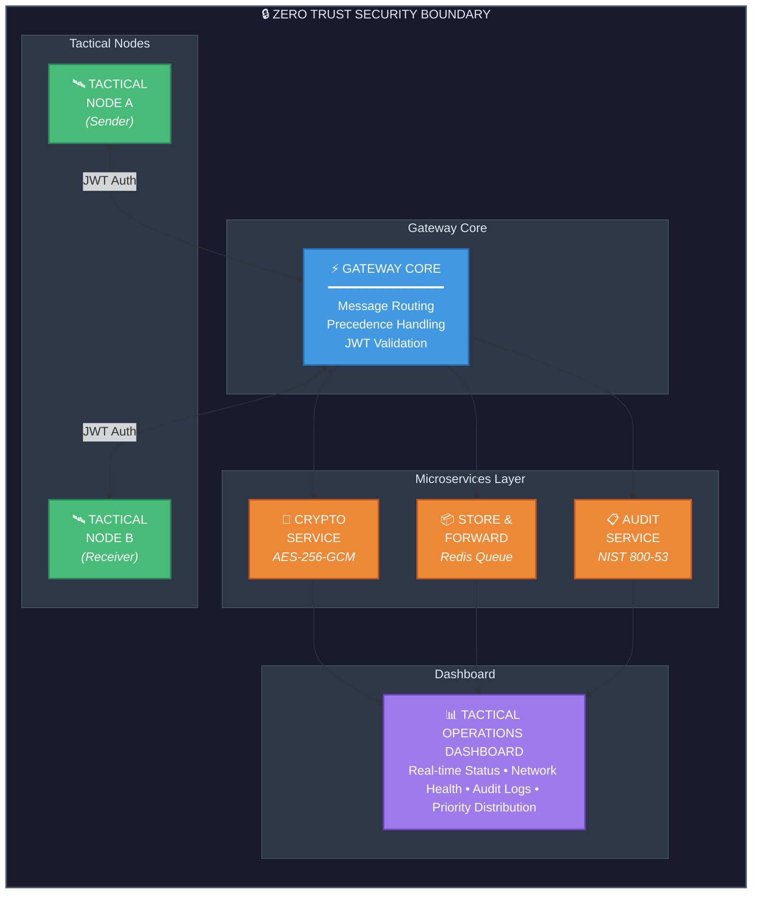
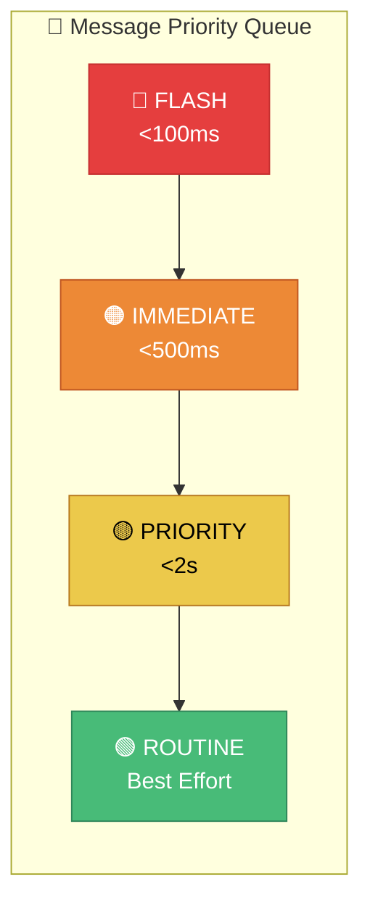
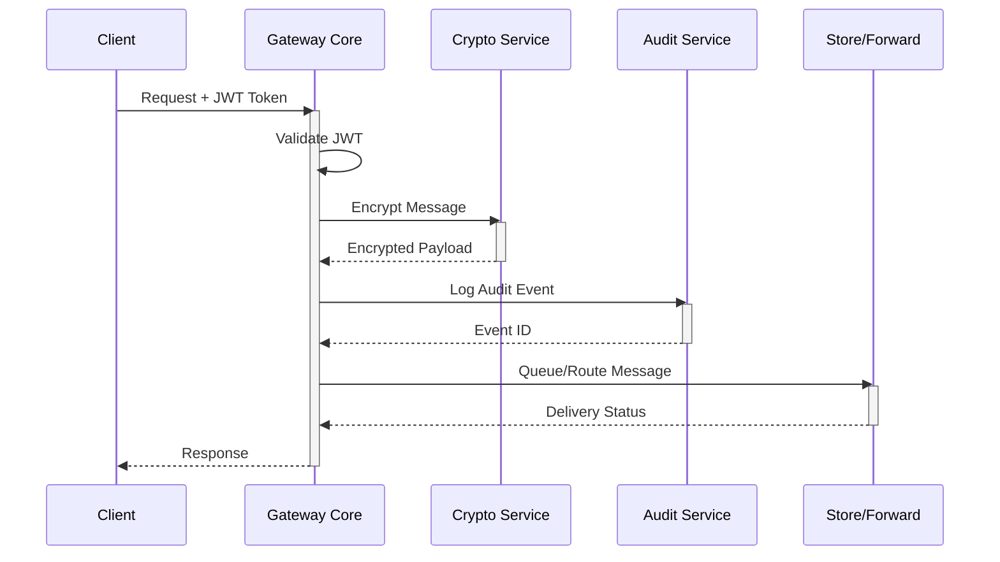
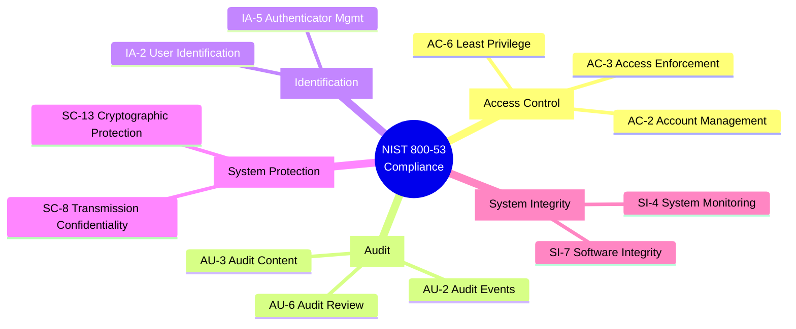

# TacEdge Gateway Architecture

```mermaid
flowchart TB
    subgraph ZT["🔒 ZERO TRUST SECURITY BOUNDARY"]
        direction TB

        subgraph NODES["Tactical Nodes"]
            direction LR
            NA["🛰️ TACTICAL<br/>NODE A<br/><i>(Sender)</i>"]
            NB["🛰️ TACTICAL<br/>NODE B<br/><i>(Receiver)</i>"]
        end

        subgraph CORE["Gateway Core"]
            GW["⚡ GATEWAY CORE<br/>━━━━━━━━━━━━━━━<br/>Message Routing<br/>Precedence Handling<br/>JWT Validation"]
        end

        subgraph SERVICES["Microservices Layer"]
            direction LR
            CRYPTO["🔐 CRYPTO<br/>SERVICE<br/><i>AES-256-GCM</i>"]
            SF["📦 STORE &<br/>FORWARD<br/><i>Redis Queue</i>"]
            AUDIT["📋 AUDIT<br/>SERVICE<br/><i>NIST 800-53</i>"]
        end

        subgraph DASH["Dashboard"]
            DB["📊 TACTICAL OPERATIONS DASHBOARD<br/>Real-time Status • Network Health • Audit Logs • Priority Distribution"]
        end
    end

    NA <-->|"JWT Auth"| GW
    GW <-->|"JWT Auth"| NB
    GW --> CRYPTO
    GW --> SF
    GW --> AUDIT
    CRYPTO --> DB
    SF --> DB
    AUDIT --> DB

    classDef nodeStyle fill:#48bb78,stroke:#2f855a,color:white,stroke-width:2px
    classDef coreStyle fill:#4299e1,stroke:#2b6cb0,color:white,stroke-width:2px
    classDef serviceStyle fill:#ed8936,stroke:#c05621,color:white,stroke-width:2px
    classDef dashStyle fill:#9f7aea,stroke:#6b46c1,color:white,stroke-width:2px

    class NA,NB nodeStyle
    class GW coreStyle
    class CRYPTO,SF,AUDIT serviceStyle
    class DB dashStyle

    style ZT fill:#1a1a2e,stroke:#4a5568,stroke-width:2px,color:#e2e8f0
    style NODES fill:#2d3748,stroke:#4a5568,color:#e2e8f0
    style CORE fill:#2d3748,stroke:#4a5568,color:#e2e8f0
    style SERVICES fill:#2d3748,stroke:#4a5568,color:#e2e8f0
    style DASH fill:#2d3748,stroke:#4a5568,color:#e2e8f0
```

## Message Precedence Levels

```mermaid
flowchart LR
    subgraph PRECEDENCE["📡 Message Priority Queue"]
        direction TB
        F["🔴 FLASH<br/><100ms"]
        I["🟠 IMMEDIATE<br/><500ms"]
        P["🟡 PRIORITY<br/><2s"]
        R["🟢 ROUTINE<br/>Best Effort"]
    end

    F --> I --> P --> R

    classDef flash fill:#e53e3e,stroke:#c53030,color:white
    classDef immediate fill:#ed8936,stroke:#c05621,color:white
    classDef priority fill:#ecc94b,stroke:#b7791f,color:black
    classDef routine fill:#48bb78,stroke:#2f855a,color:white

    class F flash
    class I immediate
    class P priority
    class R routine
```

## Authentication Flow

```mermaid
sequenceDiagram
    participant C as Client
    participant G as Gateway Core
    participant CR as Crypto Service
    participant A as Audit Service
    participant S as Store/Forward

    C->>G: Request + JWT Token
    activate G
    G->>G: Validate JWT
    G->>CR: Encrypt Message
    activate CR
    CR-->>G: Encrypted Payload
    deactivate CR
    G->>A: Log Audit Event
    activate A
    A-->>G: Event ID
    deactivate A
    G->>S: Queue/Route Message
    activate S
    S-->>G: Delivery Status
    deactivate S
    G-->>C: Response
    deactivate G
```

## NIST 800-53 Control Mapping

```mermaid
mindmap
  root((NIST 800-53<br/>Compliance))
    AC[Access Control]
      AC-2 Account Management
      AC-3 Access Enforcement
      AC-6 Least Privilege
    AU[Audit]
      AU-2 Audit Events
      AU-3 Audit Content
      AU-6 Audit Review
    IA[Identification]
      IA-2 User Identification
      IA-5 Authenticator Mgmt
    SC[System Protection]
      SC-8 Transmission Confidentiality
      SC-13 Cryptographic Protection
    SI[System Integrity]
      SI-4 System Monitoring
      SI-7 Software Integrity
```

